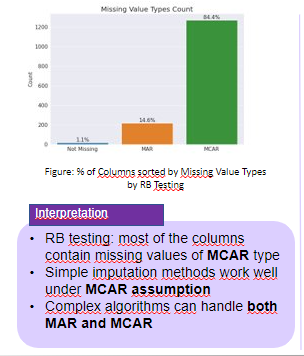
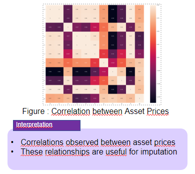
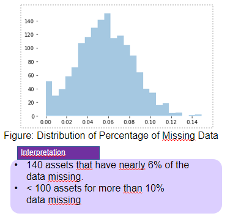
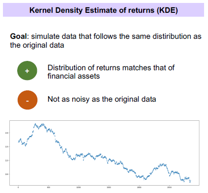
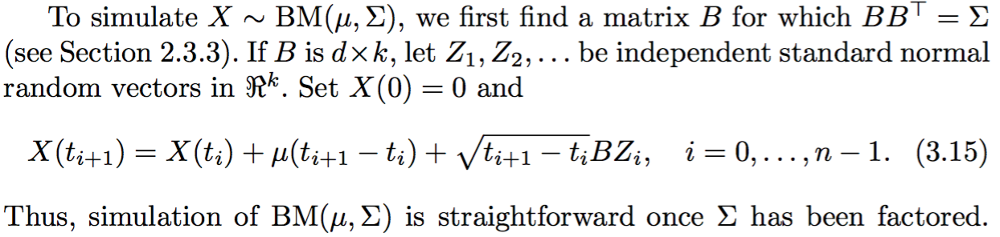
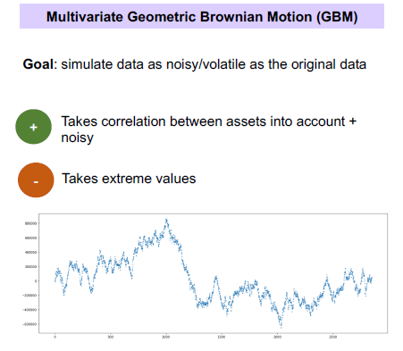

# Natixis Data Challenge

## Project Description

The goal of the challenge was to impute missing values in financial time series. Financial data can often be incomplete. Missing values can impact the performance of models that are constructed from that data. Moreover, it can have a significant impact on the covariance matrix which is fundamental in predicting risk.

## Usage

#### Virtual environment setup

Run the following commands in the terminal to set up the environment with all the dependencies
```bash
# Create a virtual environment
python3 -m venv env
# Activate the virtual environment
source env/bin/activate
# Install dependencies
make
```

## Data Sources

We were provided with 1504 time series with a history from 01/01/2010 to 30/10/2020
+ 327 time series of share prices and stock indices
+ 59 time series of OAT bond prices
+ 111 time series of exchange rates
+ 251 time series of interest rates
+ 81 time series of commodity prices
+ 675 time series of CDS spreads

The data had around 5% missing observations.

## Exploratory Data Analysis

<details>
<summary>Show/Hide</summary>
<h4>Missing Value Types</h4>
 
<h4>Correlation between assets</h4>

<h4>Histogram of Proportion of Missing Values</h4>

</details>

## Data Simulation

We used two methods to simulate data in order to test the model performance.
<details>
<summary>Kernel Density Estimate of returns</summary>
<br>
<p>
    For each asset we sample from it's distributtion of returns to generate new values at each timestep.
</p>

    <p>Source code: <a href="https://gitlab.repositories.hec.hfactory.io/data-challenges/natixis-risks-2021/group5/natixis-challenge-group6/-/blob/master/data_generation/data_generation_kde.py">data_generation/data_generation_kde.py</a> </p>

</details>
<details>
<summary>Multivariate Geometric Browian Motion</summary>
    <br>
<p>
    To simulate a Brownian Motion path, we followed this approached described by <a href="https://www.springer.com/gp/book/9780387004518">Glasserman's Monte Carlo Methods in Financial Engineering</a>:

<br>
<br>

    
where 
<ul>
    <li>
        X(0) is an array consisting of all first non-nan values taken by the commodities
    </li>
    <li>
        mu is the drift vector, i.e. the mean difference between D_t+1 and D_t for a column Dt, for all given commodities
    </li>
    <li>
        t is the time vector - bear in mind that we discretized it by considering 1 observation for 1 day, i.e. t_i+1 - t_i = 1
    <li>
       B is the lower triangular matrix of the cholesky decomposition of the covariance matrix of the original dataset given by Natixis
    </li>
    <li>
       Z_i are independent standard normal random vectors
    </li>
    </ul>
<br>
Since the covariance matrix of the dataset given by Natixis is not positive semi-definite, we had to rely on an approximation.
That is, we used the nearest positive definite Matrix by the Frobenius Norm.
For that, we used an adaptation of MATLAB's nearestPD function based on N.J. Higham's "Computing a nearest symmetric positive semidefinite
    matrix" (1988):
<ul>
    <li>
        [1] <a href="https://www.mathworks.com/matlabcentral/fileexchange/42885-nearestspd">https://www.mathworks.com/matlabcentral/fileexchange/42885-nearestspd</a>
    </li>
    <li>
        [2] N.J. Higham, "Computing a nearest symmetric positive semidefinite
        matrix" (1988): <a href="https://doi.org/10.1016/0024-3795(88)90223-6">https://doi.org/10.1016/0024-3795(88)90223-6</a>
    </li>
</ul>
    

    <p>Source code: <a href="https://gitlab.repositories.hec.hfactory.io/data-challenges/natixis-risks-2021/group5/natixis-challenge-group6/-/blob/master/data_generation/data_generation_gbm.py">data_generation/data_generation_gbm.py</a> </p>

</details>


## Imputation Methods
<details>
<summary>Iterative Imputation using Bayesian Ridge (Best Performing)</summary>
<br>
<strong>Algorithm principle</strong><br>
At first, missing values are imputed with the mean of each asset. Then, for each asset:
<ul>
<li>
Conduct a Bayesian Ridge Linear Regression based on on the other columns
</li>
<li>
Fill the missing values
</li>
</ul>
This model gave us the best score on the true dataset (nrmse=0.06)

Notebook: <a href="https://gitlab.repositories.hec.hfactory.io/data-challenges/natixis-risks-2021/group5/natixis-challenge-group6/-/blob/master/models/bayesian_ridge.ipynb">models/bayesian_ridge.ipynb/</a>
</details>
<details>
<summary>Amelia II</summary>
<br>
An algorithm that uses expectation maximization to impute missing values
This model gave us very good scores on the simulated data but was difficult to scale.

Notebook: <a href="https://gitlab.repositories.hec.hfactory.io/data-challenges/natixis-risks-2021/group5/natixis-challenge-group6/-/blob/master/models/Amelia-II%20GBM+KDE.R">models/Amelia-II GBM+KDE.R/</a>
</details>
<details>
<summary>Other Simpler models</summary>
<br>
 
Some simpler models gave us good performance as well.
<br>

<strong>Interpolation</strong><br>
Interpolation is a mathematical technique to impute missing values using the adjacent, non-missing values.
<br>

<strong>Weigted Moving Average:</strong><br>
Weighted moving average uses a semi-adaptive window size to ensure all NAs are replaced.
<br>
   
<strong>Last Observation Carried Forward:</strong><br>
LOCF replaces each missing value with the most recent present value prior to it.
<br>

Notebook: <a href="https://gitlab.repositories.hec.hfactory.io/data-challenges/natixis-risks-2021/group5/natixis-challenge-group6/-/blob/master/models/simple_models.ipynb">models/simple_models.ipynb/</a>
</details>

## Future Improvements
+ Implementation using distributed frameworks like Spark to parallelize processing.
+ Model Stacking to get an aggregated prediction.
+ Hyperparameter tuning to improve performance

## Tools used
+ Python with Numpy, Pandas and Scikit Learn
+ R
+ Gitlab
+ Jupyterlab (HEC Data Factory)

## Authors
+ Akhila Vangara
+ Arthur Krieff
+ Leon Leitao
+ Marc Vigneron
+ Pragya Singh
